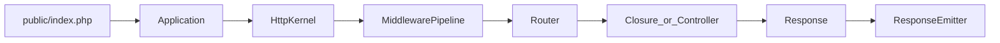

# SunnyPHP 轻量内核（PHP 8.4）

第一期只做**可运行的内核**，不写数据库 / Cache / Queue / Auth。API 走 PSR 与显式调用，不用 Facade、不用 AOP、不用注解 DI。

## 目标

- PHP `^8.4`，PSR-4 自动加载，命名空间 `SunnyPHP\`
- Composer 包名：`sunnyphp/framework`
- 一条请求能从 `public/index.php` 进，经中间件、路由，打到闭包或控制器，再返回 JSON/文本
- `php bin/sunny serve` 起内置开发服务器；`php bin/sunny route:list` 列出路由

## 目录

```text
SunnyPHP/
  composer.json
  public/index.php          HTTP 入口
  bin/sunny                 CLI 入口
  config/app.php
  routes/web.php
  app/Http/Controllers/HomeController.php
  app/Http/Middleware/RequestId.php
  src/                      框架内核
  tests/
  README.md
```

内核按职责拆分（全部自研，除 PSR 接口包外不依赖 Illuminate / Hyperf）：

- [`src/Application.php`](src/Application.php) — 应用生命周期、基路径、启动
- [`src/Container/Container.php`](src/Container/Container.php) — PSR-11 + 构造函数自动注入
- [`src/Config/Repository.php`](src/Config/Repository.php) — 点语法配置
- [`src/Http/Kernel.php`](src/Http/Kernel.php) — 请求处理主循环
- [`src/Http/Request.php`](src/Http/Request.php) / [`Response.php`](src/Http/Response.php) / [`ResponseEmitter.php`](src/Http/ResponseEmitter.php)
- [`src/Routing/Router.php`](src/Routing/Router.php) / [`Route.php`](src/Routing/Route.php)
- [`src/Middleware/Pipeline.php`](src/Middleware/Pipeline.php)
- [`src/Exception/Handler.php`](src/Exception/Handler.php)
- [`src/Logging/Logger.php`](src/Logging/Logger.php)
- [`src/Console/Kernel.php`](src/Console/Kernel.php)

## 请求链路



1. 创建 `Application`，加载 `config/`，把自身与核心服务绑进容器
2. `Http\Kernel` 从超全局变量组装 `Request`
3. 全局中间件管道执行（PSR-15 风格：`process(Request, RequestHandler)`）
4. `Router` 按 method + path 匹配，解析 `{id}` / `{id:\d+}`，注入路由参数
5. 调度闭包或 `[Controller::class, 'method']`（控制器由容器 `make`）
6. 未捕获异常交给 `Exception\Handler`，生产环境隐藏堆栈
7. `ResponseEmitter` 输出状态码、头、body

## 核心 API（刻意保持小而显式）

路由（`routes/web.php`）：

```php
$router->get('/', [HomeController::class, 'index']);
$router->get('/hello/{name}', function (Request $request): Response {
    return Response::json(['message' => 'Hello, '.$request->attribute('name')]);
});
```

容器：

```php
$container->bind(LoggerInterface::class, Logger::class);
$controller = $container->make(HomeController::class); // 构造函数自动注入
```

中间件实现 `SunnyPHP\Contracts\MiddlewareInterface`，在 `config/app.php` 的 `middleware` 数组注册。

## PHP 8.4 用法（内核里真实用到，不是摆设）

- 非对称可见性：`Application` 的 `$container` 用 `public private(set)`
- Property hooks：`Request` 的 `$path` / `$method` 只读计算属性
- 新数组函数：路由匹配、中间件查找用 `array_find` / `array_any`
- `#[\Override]`、typed constants、constructor promotion

HTTP 消息：自研精简 `Request`/`Response`（够用即可），**不**实现完整 PSR-7 以控制体积；容器实现 PSR-11，日志实现 PSR-3。Composer 只引入：

- `psr/container`、`psr/log`
- `phpunit/phpunit`（dev）

## CLI 第一期命令

- `serve` — `php -S 127.0.0.1:8000 -t public`
- `list` — 列出命令
- `route:list` — 方法 / 路径 / 处理器

## 验收

- `composer install` 后 `php bin/sunny serve`，访问 `/` 返回 JSON
- 访问 `/hello/sunny` 返回带路径参数的 JSON
- 未知路由 404，抛异常 500（debug 时带 message）
- `php vendor/bin/phpunit`：容器绑定/make、路由匹配（含正则参数）、中间件顺序、404/500

## 明确不做（第二期）

数据库、Cache、Session、Validation、Auth、Queue、协程 Server、AOP、Facade。
