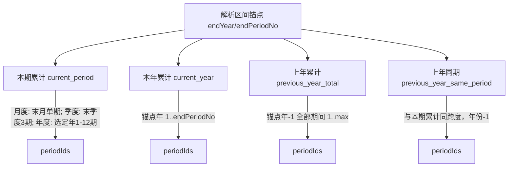
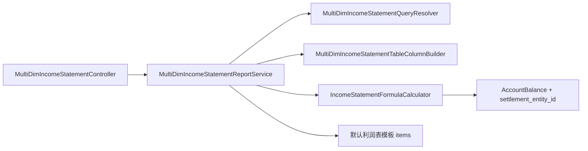

# 多维利润表（通用标准表）实现计划

## 需求摘要

| 项 | 说明 |
|----|------|
| 数据来源 | 固定读取当前账套 **默认利润表模板**（`report_type=2`, `is_default=true`），行结构/公式与利润表一致 |
| 报表性质 | 通用标准表，`report_type=3`（`MULTI_DIM_INCOME`），**不支持编辑、不需要模板** |
| 统计维度 | **首期仅结算主体**（`settlement_entity`）；按所选主体动态扩列，另含「合计」列组 |
| 列结构 | 固定列（项目、行次）+ N 个主体列组 + 1 个「合计」列组；每组含 1~4 个指标子列 |

## 指标口径（与现有利润表差异）

现有 [`IncomeStatementReportService::resolveDefaultPeriodIds`](app/Service/IncomeStatementReportService.php) 仅 3 种模式；多维表需 **4 种独立口径**：



| 指标 key | 中文 | 期间集合 |
|----------|------|----------|
| `current_period` | 本期累计 | **区间末段**：月度=末月；季度=末季度含 3 期；年度=选定年全部期间 |
| `current_year` | 本年累计 | 锚点年 `1 .. endPeriodNo` |
| `previous_year_total` | 上年累计 | 锚点年 `-1` 的 **整年全部期间**（与利润表 `previous_year` 的 YTD 不同） |
| `previous_year_same_period` | 上年同期 | 与 `current_period` **同跨度**，年份 `-1` |

**区间类型与可用指标：**

- `interval_type=year`：仅 `current_period`（需求 6）
- `interval_type=quarter|month`：最多 4 个指标，由前端 checkbox 控制是否展示（需求 7）
- 季度/月度 **不可跨年**（原型提示）

**季度映射**（无 DB 字段，按 `period_no` 推算）：Q1=1-3, Q2=4-6, Q3=7-9, Q4=10-12。

## 统计维度设计（已确认：首期仅结算主体）

### API 参数

```json
{
  "interval_type": "month",
  "start_year": 2026, "start_month": 8,
  "end_year": 2026, "end_month": 8,
  "settlement_entity_uids": ["uid-a", "uid-b"],
  "show_current_period": true,
  "show_current_year": true,
  "show_previous_year_total": true,
  "show_previous_year_same_period": true,
  "hide_empty_entities": false,
  "lock_query": false
}
```

季度模式用 `start_quarter` / `end_quarter`；月度可复用 `start_period_uid`/`end_period_uid` 或 year+month。

> v1 不传 `dimension_type`，固定为 `settlement_entity`；后续扩展其他维度时再增加该参数。

### 维度与取数

- **v1 唯一维度**：结算主体（[`DimensionObjectTypeI18n::SETTLEMENT_ENTITY`](app/Constants/I18n/Accounts/Set/DimensionObjectTypeI18n.php)）
- 入参 `settlement_entity_uids[]` 对应前端「选择具体记录对象实例」
- 取数：[`AccountBalance`](app/Model/AccountBalance.php) 按 `settlement_entity_id` 过滤（扩展 [`loadOccurrenceMap`](app/Service/IncomeStatementReportService.php)）
- **每个主体 1 组列**（本期累计/本年累计/上年累计/上年同期，按区间类型与 checkbox 决定子列数量）
- **合计列**：所选主体各指标求和；始终保留
- **未选主体**：仅返回「合计」列组结构；数据为空，前端提示「请选择记录对象」
- **主体列表来源**：复用 [`SettlementEntityAccountService`](app/Service/SettlementEntityAccountService.php) 校验 uid 有效性

## 动态列结构（对齐原型图 2）

[`PnlStatisticsReportService::columns()`](app/Service/PnlStatisticsReportService.php) 为参考：列配置与列表 **同参同源**。

```
固定列: project_name | line_number
动态列组 (每个主体 + 合计):
  ├─ header: 主体名称 / "合计"
  └─ children (1~4):
       current_period | current_year | previous_year_total | previous_year_same_period
```

**列 key 约定**（行数据平铺，便于前端渲染）：

- 主体列：`entity_{entityUid}__current_period`
- 合计列：`total__current_year`

**columns 响应示例片段：**

```json
{
  "columns": [
    { "key": "project_name", "type": "fixed" },
    { "key": "line_number", "type": "fixed" },
    {
      "key": "entity_uid_a",
      "type": "entity_group",
      "settlement_entity_uid": "uid-a",
      "settlement_entity_name": "主体A",
      "children": [
        { "key": "entity_uid_a__current_period", "metric": "current_period", "i18n_txt": {...} }
      ]
    },
    {
      "key": "total",
      "type": "total_group",
      "children": [...]
    }
  ]
}
```

## 架构



### 核心策略

1. **不复用模板 CRUD**：只读；`GET` 列表 + `GET` 列配置（+ 可选 export 二期）
2. **复用公式引擎**：从 [`IncomeStatementReportService`](app/Service/IncomeStatementReportService.php) 抽取可注入 `settlementEntityId` 的计算逻辑到新类 [`IncomeStatementFormulaCalculator`](app/Support/Report/IncomeStatementFormulaCalculator.php)（或 trait），避免复制 `computeLineValues` / `buildSubjectOccurrenceResolver`
3. **行数据**：18 行标准利润表，`is_editable=false`，标题/占位行金额仍为 `null`
4. **查询偏好**：接入 [`ReportQueryPreferenceService`](app/Service/ReportQueryPreferenceService.php)，`report_type=3`

## 新增文件

| 文件 | 职责 |
|------|------|
| [`app/Controller/V1/Report/MultiDimIncomeStatementController.php`](app/Controller/V1/Report/MultiDimIncomeStatementController.php) | `GET v1/multi-dim-income-statement`、`/columns` |
| [`app/Service/MultiDimIncomeStatementReportService.php`](app/Service/MultiDimIncomeStatementReportService.php) | 区间解析、按主体循环取数、合计 |
| [`app/Support/Report/MultiDimIncomeStatementQueryResolver.php`](app/Support/Report/MultiDimIncomeStatementQueryResolver.php) | 年度/季度/月度区间 → 锚点 year/periodNo + 四指标 periodIds |
| [`app/Support/Report/MultiDimIncomeStatementTableColumnBuilder.php`](app/Support/Report/MultiDimIncomeStatementTableColumnBuilder.php) | 动态列组构建 |
| [`app/Support/Report/IncomeStatementFormulaCalculator.php`](app/Support/Report/IncomeStatementFormulaCalculator.php) | 从现有 Service 抽取，支持 `?int $settlementEntityId` |
| [`app/Request/V1/Report/MultiDimIncomeStatementReportRequest.php`](app/Request/V1/Report/MultiDimIncomeStatementReportRequest.php) | 校验 interval、维度、指标开关 |
| [`app/Constants/I18n/Accounts/Set/Report/MultiDimIncomeStatementMetricI18n.php`](app/Constants/I18n/Accounts/Set/Report/MultiDimIncomeStatementMetricI18n.php) | 四指标 i18n |
| [`app/Constants/I18n/Accounts/Set/Report/MultiDimIncomeStatementIntervalTypeI18n.php`](app/Constants/I18n/Accounts/Set/Report/MultiDimIncomeStatementIntervalTypeI18n.php) | year/quarter/month |
| Resource 类 | `MultiDimIncomeStatementColumnsResource`、`MultiDimIncomeStatementTableResource` |

## 改造现有文件

| 文件 | 改动 |
|------|------|
| [`IncomeStatementReportService.php`](app/Service/IncomeStatementReportService.php) | 委托 `IncomeStatementFormulaCalculator`；`loadOccurrenceMap` 增加可选 `settlementEntityId` |
| 可选 | 若默认利润表种子尚未落地，需确保 [`is_default` 利润表模板](app/Service/IncomeStatementReportService.php) 存在，否则多维表无法取行定义 |

## 列表响应结构

```json
{
  "report_type": 3,
  "report_name": "多维利润表",
  "query": {
    "interval_type": "month",
    "anchor_year": 2026,
    "anchor_period_no": 8,
    "dimension_type": "settlement_entity",
    "settlement_entities": [{ "uid": "...", "name": "主体A" }]
  },
  "columns_meta": [...],
  "items": [
    {
      "row_type": 2,
      "project_name": "一、营业收入",
      "line_number": 1,
      "entity_uid_a__current_period": "1000.00",
      "total__current_period": "1000.00"
    }
  ]
}
```

## 校验规则

- `interval_type=year` 时忽略另外 3 个指标开关，强制仅 `current_period`
- 季度/月度：`start_year === end_year`；季度 `start_quarter <= end_quarter`
- `settlement_entity_uids` 需属于当前账套有效结算主体
- `hide_empty_entities=true` 时，主体组四指标全为 0 则隐藏该主体列（合计仍保留）

## 测试要点

- 区间解析：月/季/年 → 四指标 periodIds 正确
- 跨年季度/月度请求被拒绝
- 年度模式 columns 仅含 `current_period`
- 选 2 个主体 → 2 组 + 合计；合计 = 两主体之和
- 公式行（行次 11/14/16/18）按主体独立计算后合计
- 与单主体利润表在「仅选合计 + 月度 + 仅本期累计」场景下数值一致（回归）

## 分期建议

**Phase 1（本次）**：结算主体维度 + 列表/列配置 + 四指标 + 三种区间  
**Phase 2（后续）**：导出 Excel、组织/项目等其他统计维度、查询偏好 UI 锁定

## 风险

- 默认利润表模板若未 seed，需先补系统默认模板（conversation 中曾规划 `IncomeStatementDefaultTemplateDefinition`，需确认是否已合并）
- `AccountBalance` 仅 `settlement_entity_id`，非结算主体类维度需另设计取数链路
