# 期间结账校验详情跳转标识设计

## 现状

- 接口：[`PeriodCloseController::checkDetail`](app/Controller/V1/ClosingValidation/PeriodCloseController.php) → [`PeriodCloseService::getCheckDetail`](app/Service/PeriodClose/PeriodCloseService.php) → [`PeriodCloseCheckDetailResource`](app/Resource/Application/V1/ClosingValidation/PeriodCloseCheckDetailResource.php)
- 每条校验结果（[`PeriodCloseCheckResult`](app/Model/PeriodCloseCheckResult.php)）当前只返回：
  - `message`：来自规则配置的 `fail_action` / `special_note` 文案（左侧灰色说明）
  - `detail`：校验引擎明细（JSON，可选）
- **缺少**：蓝色可点击链接的结构化标识
- 项目已有路由约定：Controller 注解 `frontRouteAlias`（如 `batch-voucher.batch-voucher-creation.settlement-statement`），前端权限/菜单体系已依赖此标识

## 设计原则

| 职责 | 后端 | 前端 |
|------|------|------|
| 链接文案 | 提供 `label` | 渲染蓝色文字 |
| 跳转目标 | 提供唯一标识 `route_key` | 维护 `route_key → 路由/URL` 映射表 |
| 跳转参数 | 提供 `nav_context` + 可选 `params` | 拼 query / route params |
| 是否展示 | 仅 `result_status` 为 2(未通过)/3(仅提醒) 时返回非空 `actions` | 有 `actions` 才渲染链接 |

**不在后端返回完整 URL**，避免前后端路由耦合；`route_key` 直接复用 `frontRouteAlias` 命名风格。

## 响应结构（目标）

```json
{
  "run": {
    "id": 123,
    "nav_context": {
      "account_id": 1,
      "period_id": 10,
      "year": 2025,
      "period_no": 11,
      "calendar_id": 3
    }
  },
  "groups": [
    {
      "group_type": 1,
      "group_name": "业务单校验",
      "items": [
        {
          "id": 456,
          "check_name": "业务单据清单",
          "result_status": 2,
          "message": "请处理待审业务单据",
          "actions": [
            {
              "label": "业务单列表",
              "route_key": "settlement.business-order"
            },
            {
              "label": "结算单批量制证",
              "route_key": "batch-voucher.batch-voucher-creation.settlement-statement"
            }
          ]
        }
      ]
    }
  ]
}
```

- `message`：保持现有语义，纯说明文字
- `actions`：结构化跳转列表（0~N 条），与 UI 右侧蓝色字体一一对应
- `nav_context`：挂在 `run` 上，所有 action 共享（账套、期间等筛选条件）

## 核心：rule_key → actions 注册表

新增 [`app/Support/PeriodClose/SettleCheckRuleActionRegistry.php`](app/Support/PeriodClose/SettleCheckRuleActionRegistry.php)：

```php
// 伪代码
public static function resolve(string $ruleKey, int $resultStatus): array
{
    if (!in_array($resultStatus, [FAILED, WARN_ONLY])) {
        return [];
    }
    return match ($ruleKey) {
        SettleCheckRuleKey::BUSINESS_DOC_LIST => [
            ['label' => '业务单列表', 'route_key' => '...'],
        ],
        SettleCheckRuleKey::SETTLEMENT_VOUCHER_MAPPING => [
            ['label' => '结算单批量制证', 'route_key' => 'batch-voucher.batch-voucher-creation.settlement-statement'],
        ],
        SettleCheckRuleKey::AUDIT_COMPLETE => [
            ['label' => '凭证列表', 'route_key' => 'voucher-management.voucher-entry-list'],
        ],
        // ... 其余 rule_key
        default => [],
    };
}
```

**初始映射范围**（基于 [`SettleCheckRuleKey`](app/Constants/I18n/SettleCheck/SettleCheckRuleKey.php) 与现有 `frontRouteAlias`）：

| rule_key | label | route_key |
|----------|-------|-----------|
| `voucher_serial_continuous` | 凭证列表 | `voucher-management.voucher-entry-list` |
| `foreign_currency_pl` | 期末调汇 | `period-end.exchange-rate-adjustment` |
| `pl_account_zero` | 结转损益 | `period-end.profit-loss-carry-forward` |
| `audit_complete` | 凭证列表 | `voucher-management.voucher-entry-list` |
| `settlement_voucher_mapping` | 结算单批量制证 | `batch-voucher.batch-voucher-creation.settlement-statement` |
| `receipt_voucher_mapping` | 收付流水单 | `batch-voucher.batch-voucher-creation.receipt-payment-flow` |
| `invoice_voucher_mapping` | 发票单 | `batch-voucher.batch-voucher-creation.invoice-statement` |
| `business_doc_list` | 业务单列表 | 待与前端确认 alias |
| 无对应页面 | — | 返回空数组，不展示链接 |

未映射的 `rule_key` 安全降级为空数组，不影响校验流程。

## 数据流

```mermaid
flowchart LR
    subgraph execute [校验执行]
        RuleConfig["settle_check_rule_config.rule_key"]
        ExecuteService["SettleCheckExecuteService"]
        CheckResult["period_close_check_result"]
        RuleConfig --> ExecuteService
        ExecuteService -->|"快照 rule_key"| CheckResult
    end

    subgraph detail [详情查询]
        GetDetail["PeriodCloseService.getCheckDetail"]
        Registry["SettleCheckRuleActionRegistry"]
        Resource["PeriodCloseCheckResultResource"]
        CheckResult --> GetDetail
        GetDetail --> Resource
        Resource -->|"rule_key + result_status"| Registry
        Registry -->|"actions[]"| Resource
    end
```



## 需改动的文件

### 1. 数据库：快照 rule_key

新增 migration，给 [`period_close_check_result`](migrations/2026_06_13_101255_create_period_close_check_result_table.php) 增加：

```php
$table->string('rule_key', 64)->nullable()->comment('规则标识快照');
```

- 校验写入时从规则配置带入；warn 类校验项可为 null
- 历史数据可为 null → `actions` 返回 `[]`

### 2. 校验执行：写入 rule_key

[`SettleCheckExecuteService`](app/Service/PeriodClose/SettleCheckExecuteService.php) 创建 `PeriodCloseCheckResult` 时：

- 基础校验项：已有 `rule_key` 字段（[`PeriodCloseBasicCheckService::buildCheckItems`](app/Service/PeriodClose/PeriodCloseBasicCheckService.php)）
- 其他规则项：从 `$rule['rule_key']` 取值
- 写入 `period_close_check_result.rule_key`

同步更新 [`PeriodCloseCheckResult`](app/Model/PeriodCloseCheckResult.php) 的 `$fillable`。

### 3. 详情 Resource：输出 actions + nav_context

- [`PeriodCloseCheckResultResource`](app/Resource/Application/V1/ClosingValidation/PeriodCloseCheckResultResource.php)：
  - 新增 `rule_key`
  - 新增 `actions`：调用 `SettleCheckRuleActionRegistry::resolve($ruleKey, $resultStatus)`
- [`PeriodCloseRunResource`](app/Resource/Application/V1/ClosingValidation/PeriodCloseRunResource.php) 或 [`PeriodCloseCheckDetailResource`](app/Resource/Application/V1/ClosingValidation/PeriodCloseCheckDetailResource.php)：
  - 在 `run` 下增加 `nav_context`（account_id、period_id、year、period_no、calendar_id）

### 4. 注册表 + 单元测试

- 新增 `SettleCheckRuleActionRegistry`
- 测试：已知 rule_key + status 返回预期 actions；PASSED 返回空；未知 rule_key 返回空

## 前端对接约定

1. 建立 `route_key → Router.push(...)` 映射，key 与后端 `OrgPermission.frontRouteAlias` 保持一致
2. 跳转时合并 `run.nav_context` 作为默认 query（如 `period_id`、`account_id`）
3. 某条 action 若 `route_key` 在前端映射表不存在，隐藏该链接（容错）
4. `message` 与 `actions` 分离展示：左侧状态+说明，右侧蓝色 `actions[].label`

## 后续可扩展（本次不做）

- 若运营需自定义链接，可在 `settle_check_rule_config` 增加 `actions` JSON 字段覆盖注册表默认值（hybrid 方案）
- 若某校验需带单据 ID 列表，可在 `detail` 中追加 `entity_ids`，action 增加 `params: { ids: [...] }`

## 风险与待确认

- `business_doc_list` 等业务单列表页面的 `frontRouteAlias` 需与前端对齐后填入注册表；未确认前该 rule_key 返回空 actions
- 部分 rule_key（如科目余额、资产负债表）可能暂无独立页面，仅展示 message 不展示链接
